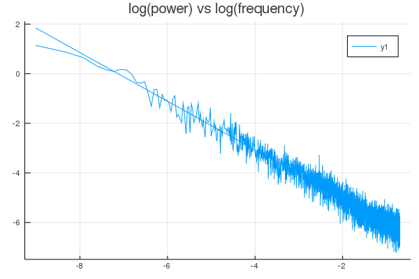

Software to generate 1/f^alpha noise, and sample data


```julia

using CSV, DataFrames, DSP, GLM, Plots

pinknoise = CSV.read("pink/pink_noise_1.csv", header=false).Column1

p1 = welch_pgram(pinknoise)

df = DataFrame(X=log.(p1.freq), Y=log.(p1.power))
deleterows!(df, 1)

ols = lm(@formula(Y ~ X), df)

```

```
Coefficients:
────────────────────────────────────────────────────────────────────────────
              Estimate  Std. Error   t value  Pr(>|t|)  Lower 95%  Upper 95%
────────────────────────────────────────────────────────────────────────────
(Intercept)  -7.00269   0.00988614  -708.334    <1e-99  -7.02207   -6.9833  
X            -0.981957  0.0050369   -194.953    <1e-99  -0.991832  -0.972082
────────────────────────────────────────────────────────────────────────────
```


```julia
plot(df.X, df.Y, title="log(power) vs log(frequency)", smooth=true)
```

